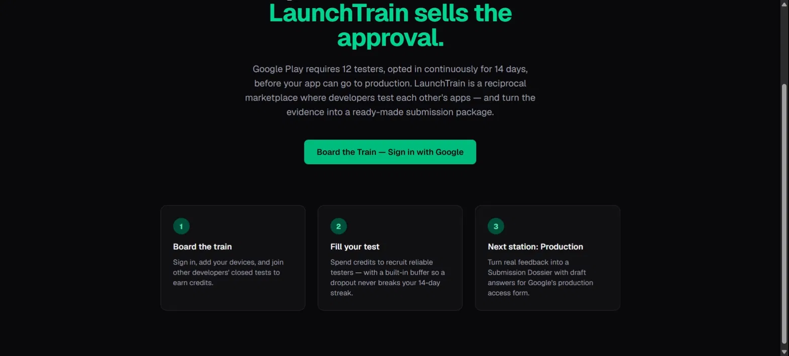
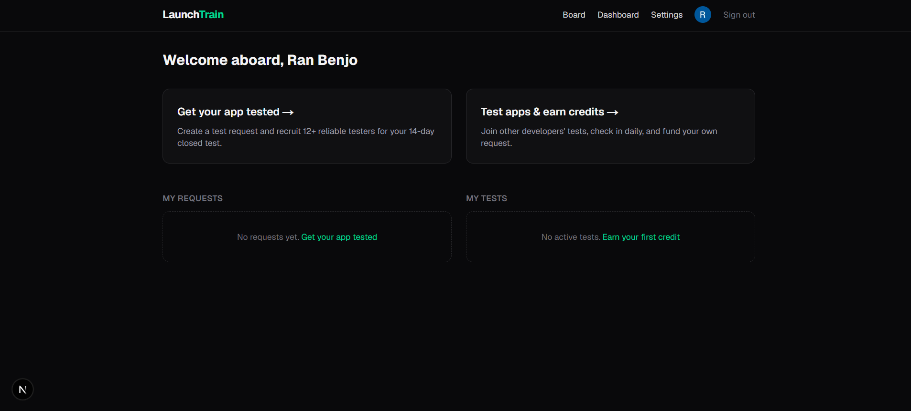
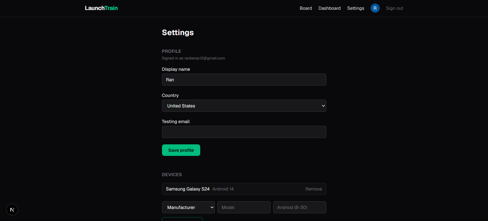

# LaunchTrain

> **Everyone else sells testers. LaunchTrain sells the approval.**

Google Play requires every new personal developer account (created after Nov 13, 2023) to run a closed test with **at least 12 testers opted in simultaneously and continuously for 14 days** before the developer can apply for Production Access. Developers fail this gate at three points: they can't find 12 reliable testers, testers drop out mid-window and break the 14-day streak, and even after 14 days Google rejects applications for shallow engagement ("Testers were not engaged"). LaunchTrain is a reciprocal marketplace where indie developers test each other's apps — a request board with a built-in tester buffer solves recruiting, credits held in escrow until day 14 solve dropouts, and an AI-generated **Submission Dossier** turns real testing evidence into draft answers for Google's production access form to solve the rejection.

The product has a single success metric: the percentage of developers who obtain Production Access.

## How it works

1. **Board the train** — sign in with Google, register your Android devices, and earn credits by testing other developers' apps: opt in, use the app, check in daily, submit structured feedback.
2. **Fill your test** — publish a test request for your own app, paying with the credits you earned (free during the founding phase). The default is 14 slots so the required 12 survive dropouts; the request's streak advances only on UTC days it holds 12+ confirmed testers.
3. **Next station: production** — after a 14-day streak, generate the Submission Dossier: device coverage matrix, engagement summary, consolidated bug list, and draft answers for Google's form — built exclusively from evidence recorded on the platform.

## Key design decisions

- **The two-clock mechanism.** Google's wording is "12 testers simultaneously, continuously, for 14 days", so a request's streak day counts only if ≥12 testers stayed confirmed throughout the entire UTC day (checked by a daily cron), and it resets to zero on a dip. Each tester additionally runs a personal 14-day clock from their own confirmation, so testers get paid fairly even when the request as a whole stalls.
- **Credits exist only as ledger rows.** There is no balance column anywhere — `credit_transactions` is the single source of truth, every row is created inside the same DB transaction as the state change that caused it, and escrow is simply `pending` rows released on completion. The ledger can carry real money later without a rewrite.
- **AI provider abstraction.** Dossier generation goes through `lib/ai/provider.ts` (Vercel AI SDK); `AI_PROVIDER` / `AI_MODEL` env vars select Google Gemini (free tier today), Anthropic, or OpenAI — swapping providers is a config change, not a refactor. One non-negotiable rule: the AI never invents testing data; missing data is reported as a gap.
- **Row Level Security on every table.** Public pages read only published data, users touch only what they own, and a tester's `testing_email` is exposed exclusively to the owner of the request they joined, through a dedicated scoped view. DB triggers back up every app-level invariant (onboarding completeness, email frozen during active engagements, minimum one device, device data bounds).
- **Founding-phase flag.** A `system_config` switch makes publishing free for the first cohort while earning stays real, so the credit economy launches populated with work-backed credits instead of a cold, empty market.

## Tech stack

- **Next.js 16** (App Router) + **TypeScript strict**, Server Components by default, **Tailwind CSS v4**
- Server Actions + Route Handlers — no separate backend
- **Supabase**: Postgres with RLS, Google OAuth, Storage
- **Vercel AI SDK** as the dossier provider layer (Gemini / Claude / GPT, env-selected)
- **Resend** for email, **Vercel Cron** for the daily clock math (all date logic in UTC)

```
Browser ── Next.js (Vercel) ──┬── Supabase Postgres (RLS)
   │            │             ├── Supabase Auth (Google OAuth)
   │            │             └── Supabase Storage (screenshots)
   │            ├── Resend API (emails)
   │            └── AI Provider Layer → Gemini / Claude / OpenAI (dossier)
   └── Vercel Cron ──→ /api/cron/* ──→ Postgres (clocks, reminders)
```

## Project status

LaunchTrain is built spec-first: [SPEC.md](SPEC.md) is the governing document (currently v1.5), and development proceeds phase by phase against it. Every completed feature is manually verified end-to-end in the browser before the next one starts.

**Phase 1 — "The Working Line" (MVP):**

- [x] Full database schema, RLS policies, and integrity triggers
- [x] F1 Auth & Profiles — Google OAuth, onboarding, settings, device management
- [x] Device data integrity — curated manufacturer list, Android 8–30 bounds enforced form → server action → DB CHECK
- [x] AI provider layer (env-swappable, SPEC §5.1)
- [x] F2 Test Request Board — create/publish requests with escrowed credits, public board with filters, manage page with freeze rules & cancel/refund (manually verified end-to-end: creation, founding publish, freeze rules, grow-only slots, public board, guest view, cancel + refund)
- [ ] F3 Engagement lifecycle & the two clocks (daily cron) ← **implemented (join/confirm/drop/replacement, two-clock cron, notifications, seed+timetravel harness); awaiting manual verification**
- [ ] F4 Check-ins & structured feedback + Reliability Score
- [ ] F6 Credits ledger with escrow + founding phase
- [ ] F5 AI Submission Dossier
- [ ] Email + in-app notifications

Phases 2–3 (automated launch trains, reputation tiers, analytics, deep-link verification, PWA) are specced in [SPEC.md](SPEC.md) §10.

## Local setup

**Prerequisites:** Node.js 20.9+, npm, and a free [Supabase](https://supabase.com) project with the Google provider enabled (Authentication → Providers → Google).

1. Clone and install:

   ```bash
   git clone https://github.com/Ranb972/launchtrain.git
   cd launchtrain
   npm install
   ```

2. Create `.env.local` with the variables below (values come from your Supabase project — never commit this file):

   | Variable | Required today | Purpose |
   |---|---|---|
   | `NEXT_PUBLIC_SUPABASE_URL` | ✅ | Supabase project URL |
   | `NEXT_PUBLIC_SUPABASE_ANON_KEY` | ✅ | Supabase anon key |
   | `NEXT_PUBLIC_APP_URL` | ✅ | `http://localhost:3456` locally |
   | `SUPABASE_SERVICE_ROLE_KEY` | ✅ | server-only; cron routes, notification emails, dev harness |
   | `CRON_SECRET` | ✅ | guards `/api/cron/*` (any random string) |
   | `ALLOW_SEED` | dev only | `true` unlocks the seed/timetravel harness — never set in production |
   | `RESEND_API_KEY`, `EMAIL_FROM` | optional | notification emails; without a key sends are logged no-ops |
   | `AI_PROVIDER`, `AI_MODEL` | optional | dossier model selection; defaults `google` / `gemini-2.5-flash` |
   | `GOOGLE_GENERATIVE_AI_API_KEY` | reserved | read by the AI SDK once dossier generation (F5) lands |
   | `ANTHROPIC_API_KEY`, `OPENAI_API_KEY` | reserved | AI provider swap targets |

3. Apply the database migrations: open the Supabase **SQL Editor**, then paste and run each file's contents **in this order**:

   1. `supabase/migrations/20260612120000_initial_schema.sql`
   2. `supabase/migrations/20260612130000_f1_db_guards.sql`
   3. `supabase/migrations/20260711120000_device_constraints.sql`
   4. `supabase/migrations/20260712120000_storage_screenshots.sql`
   5. `supabase/migrations/20260712130000_f2_publish_cancel.sql`
   6. `supabase/migrations/20260717120000_f3_engagement_lifecycle.sql`

4. Start the dev server:

   ```bash
   npm run dev
   ```

   The app runs at [http://localhost:3456](http://localhost:3456).

## Dev test harness

The engagement lifecycle can't be verified by clicking alone (it needs 12+ testers and multi-day clocks), so the repo ships a seeding/time-travel harness. It requires `ALLOW_SEED=true` in `.env.local` (never set it in production) and talks to Supabase with the service role; the `seed:*` mutations run the **same Postgres code paths** as the real UI actions, via service-role-only wrapper functions.

| Script | What it does |
|---|---|
| `npm run seed:testers` | Creates ~15 fake onboarded testers (`tester01@seed.launchtrain.local`…) with Android devices, plus one low-reliability tester for the cooldown demo. Idempotent. |
| `npm run seed:request` | Creates/reuses one recruiting request owned by a seeded user — join it with your real account to live the tester side. |
| `npm run seed:join -- --request <id> --count <n> [--opted-in] [--tester <email>]` | Joins n seeded testers through the real join path (eligibility, capacity race, notifications). |
| `npm run seed:confirm -- --request <id> [--count <n>] [--tester <email>]` | The request owner confirms pending testers (crossing 12 starts the Google clock). |
| `npm run seed:drop -- --request <id> [--count <n>] [--pending]` | A seeded tester drops (−15, streak break if below 12) or withdraws a pending join (`--pending`). Never touches real accounts. |
| `npm run timetravel -- --request <id> --days <n>` | Shifts every clock-relevant timestamp back n days — a 14-day streak in minutes. |
| `npm run cron:daily` / `npm run cron:reminders` | Trigger the local cron routes with `CRON_SECRET` (dev server must be running). |
| `npm run inspect -- --request <id>` | Read-only snapshot: status, streak fields, slot counts, engagement breakdown. |
| `npm test` | Unit tests for the pure two-clock math and transition guards. |

## Screenshots







## License

MIT — see [LICENSE](LICENSE).
